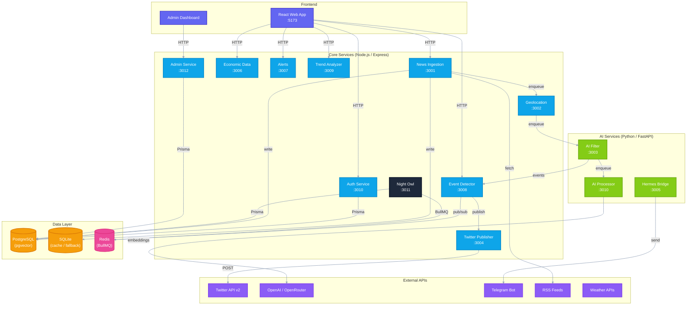
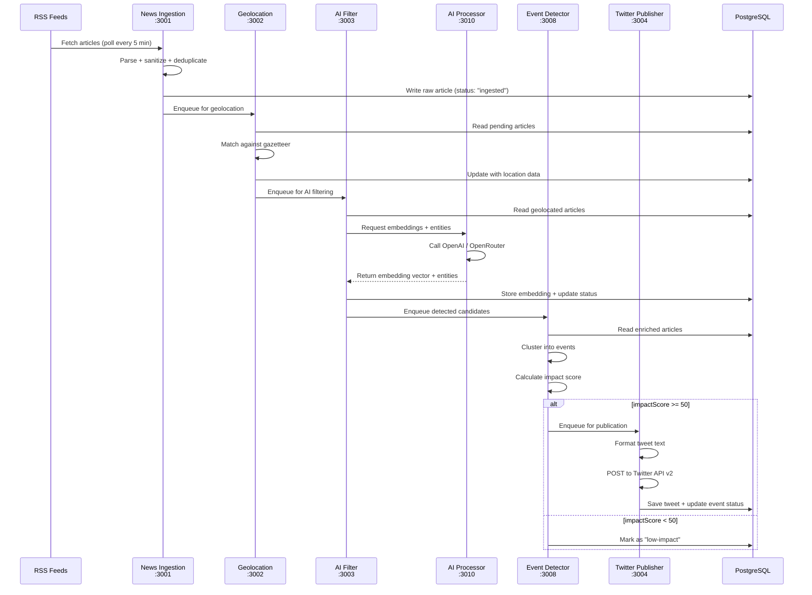

# ArgentinaRadar

**Real-time news geolocation, event detection, and automated publishing pipeline for Argentina.**

[]()
[]()
[]()

---

## System Architecture



### Legend

| Style | Layer | Technology |
|-------|-------|-----------|
| <span style="color:#6366f1">■</span> Indigo | Frontend | React + Vite + Tailwind |
| <span style="color:#0ea5e9">■</span> Blue | Core Services | Node.js / Express + TypeScript |
| <span style="color:#84cc16">■</span> Lime | AI Services | Python / FastAPI |
| <span style="color:#f59e0b">■</span> Amber | Data Layer | PostgreSQL, SQLite, Redis |
| <span style="color:#8b5cf6">■</span> Violet | External APIs | Twitter, OpenAI, Telegram |
| <span style="color:#ec4899">■</span> Pink | Queue | BullMQ / Redis |
| <span style="color:#1e293b">■</span> Dark | Automation | Cron + BullMQ |

---

## Data Flow (RSS → Twitter)



---

## Services

| # | Service | Port | Language | Description |
|---|---------|------|----------|-------------|
| 1 | **news-ingestion** | 3001 | Node.js / Express | RSS feed poller — fetches, parses, deduplicates, and stores raw articles |
| 2 | **geolocation** | 3002 | Node.js / Express | Gazetteer-based location matching — assigns lat/lng + province to articles |
| 3 | **ai-filter** | 3003 | Python / FastAPI | AI content filtering — classifies relevance, enriches with OpenAI embeddings |
| 4 | **twitter-publisher** | 3004 | Node.js / Express | Formats event data and posts tweets via Twitter API v2 |
| 5 | **hermes-bridge** | 3005 | Python / FastAPI | Telegram bot bridge — sends alerts and digests to subscribed channels |
| 6 | **economic-data** | 3006 | Node.js / Express | Fetches and exposes economic indicators (dólar, inflación, etc.) |
| 7 | **alerts** | 3007 | Node.js / Express | Push notification system — manages user alert subscriptions and delivery |
| 8 | **event-detector** | 3008 | Node.js / Express | Event clustering — groups related news, calculates impact scores |
| 9 | **trend-analyzer** | 3009 | Node.js / Express | Temporal trend analysis — tracks entity velocity and media attention |
| 10 | **ai-processor** | 3010 | Python / FastAPI | OpenAI / OpenRouter wrapper — embeddings, entity extraction, NLP |
| 11 | **auth** | 3010 | Node.js / Express | JWT authentication — login, refresh tokens, role-based access control |
| 12 | **night-owl** | 3011 | Node.js / Express | Cron + BullMQ — 7 nightly batch jobs for maintenance and analysis |
| 13 | **admin-service** | 3012 | Node.js / Express | Admin Dashboard API — KPI aggregation, user management, cost monitoring |
| — | **web-app** | 5173 | React / Vite | Frontend SPA — map view, trending, economic data, alerts |

---

## Role-Based Access

```mermaid
graph LR
    classDef visitor fill:#6366f1,color:#fff
    classDef vip fill:#0ea5e9,color:#fff
    classDef admin fill:#ef4444,color:#fff

    subgraph VISITOR
        V1["🗺️ Ver mapa público"]:::visitor
        V2["📈 Ver trending básico"]:::visitor
        V3["💰 Ver datos económicos"]:::visitor
    end

    subgraph VIP
        VIP1["✅ Todo lo de VISITOR"]:::vip
        VIP2["🔔 Alertas push"]:::vip
        VIP3["📜 Historial completo"]:::vip
        VIP4["🔍 Búsqueda semántica"]:::vip
        VIP5["🔌 API access"]:::vip
    end

    subgraph ADMIN
        A1["✅ Todo lo de VIP"]:::admin
        A2["📊 Admin Dashboard"]:::admin
        A3["👥 Gestión de usuarios"]:::admin
        A4["🔄 Override de eventos"]:::admin
        A5["💰 Monitoreo de costos AI"]:::admin
        A6["📡 Gestión de fuentes"]:::admin
    end

    VISITOR --> VIP --> ADMIN
```



### Permission Matrix

| Recurso | VISITOR | VIP | ADMIN |
|---------|---------|-----|-------|
| Mapa público | ✅ | ✅ | ✅ |
| Trending básico | ✅ | ✅ | ✅ |
| Datos económicos | ✅ | ✅ | ✅ |
| Historial de eventos | — | ✅ | ✅ |
| Búsqueda semántica | — | ✅ | ✅ |
| Alertas push | — | ✅ | ✅ |
| API tokens | — | ✅ | ✅ |
| Admin Dashboard | — | — | ✅ |
| Gestión de usuarios | — | — | ✅ |
| Override de eventos | — | — | ✅ |
| Monitoreo de costos | — | — | ✅ |
| Gestión de fuentes | — | — | ✅ |

---

## Night Owl — Automated Nightly Jobs

**7 jobs** scheduled in `America/Argentina/Buenos_Aires` (UTC-3), executed sequentially via BullMQ queues.

| Hora (ART) | Job | Descripción |
|-----------|-----|-------------|
| 🕐 01:00 | **Backfill** | Re-procesa artículos fallidos o no geolocalizados |
| 🕑 02:00 | **Digest** | Genera resumen diario de eventos + trending |
| 🕒 03:00 | **Pattern** | Detección pesada de patrones en datos históricos |
| 🕒 03:30 | **Optimizer** | Re-entrena / ajusta modelos y umbrales de score |
| 🕓 04:00 | **Predictive** | Predicciones forward-looking basadas en tendencias |
| 🕔 05:00 | **Cleanup** | Purga datos stale, logs viejos, caché expirada |
| 🕔 05:30 | **Health** | Health check end-of-cycle — reporta métricas y errores |

> **Budget:** `$1.00 USD / night` para llamadas AI durante la ventana nocturna.
> **Queue:** `night-owl` en BullMQ (Redis).
> **Toggle:** `NIGHT_OWL_ENABLED=false` para deshabilitar.

---

## KPIs Trackeados

### Per-Service Metrics (modelo `SystemMetric`)

- **CPU usage** por servicio
- **Memory (MB)** por servicio
- **Requests per minute** por servicio

### Daily Stats (modelo `DailyStats`)

| KPI | Descripción | Unidad |
|-----|-------------|--------|
| `newsIngested` | Noticias ingeridas vía RSS | count |
| `newsGeolocated` | Noticias con geolocalización exitosa | count |
| `newsFiltered` | Noticias filtradas y clasificadas por AI | count |
| `eventsDetected` | Eventos detectados (clustering) | count |
| `tweetsPublished` | Tweets publicados | count |
| `aiCost` | Costo acumulado de APIs de AI | USD |
| `activeUsers` | Usuarios activos únicos | count |
| `revenue` | Ingresos generados | USD |

### AI Cost Tracking (modelo `AiCost`)

- Tokens consumidos por día
- Costo por modelo (`openai`, `openrouter`)
- Budget diario controlado por servicio `AI_DAILY_BUDGET`

---

## Tech Stack

| Layer | Technology |
|-------|-----------|
| **Frontend** | React 19, Vite 6, Tailwind CSS 4, MapLibre GL, Globe.gl, TanStack Query, Zustand |
| **Backend (Node)** | Express.js, TypeScript, ts-node |
| **Backend (Python)** | FastAPI, Uvicorn |
| **Database** | PostgreSQL 16 + pgvector, Prisma ORM 6, SQLite (cache/fallback) |
| **Queue** | BullMQ + Redis |
| **Auth** | JWT (access + refresh tokens), bcrypt |
| **AI** | OpenAI / OpenRouter (Mistral Nemo), sentence embeddings (1536d) |
| **Scheduling** | node-cron, BullMQ repeatable jobs |
| **Process Manager** | PM2 (dev) |
| **Monorepo** | npm workspaces |

---

## Quick Start

```bash
# 1. Install dependencies
npm install

# 2. Set up environment
cp config/.env.template .env
# Edit .env with your API keys

# 3. Start PostgreSQL (Docker)
docker run -d --name argradar-pg -e POSTGRES_PASSWORD=postgres \
  -p 5432:5432 pgvector/pgvector:pg16

# 4. Start Redis (Docker)
docker run -d --name argradar-redis -p 6379:6379 redis:7-alpine

# 5. Generate Prisma client + run migrations
npm run db:generate
npm run db:migrate

# 6. Start all services via PM2
npm run dev:all

# 7. Or start individual services
npm run dev:web       # Frontend
npm run dev:news      # News Ingestion
npm run dev:geo       # Geolocation
npm run dev:twitter   # Twitter Publisher
# ... etc
```

---

## Project Structure

```
ArgentinaRadar/
├── apps/
│   └── web/                    # React SPA (Vite)
├── services/                   # 12 backend services
│   ├── news-ingestion/         # :3001  — RSS poller
│   ├── geolocation/            # :3002  — Gazetteer matcher
│   ├── ai-filter/              # :3003  — Python AI filter
│   ├── twitter-publisher/      # :3004  — Tweet poster
│   ├── hermes-bridge/          # :3005  — Python Telegram bot
│   ├── economic-data/          # :3006  — Economic indicators
│   ├── alerts/                 # :3007  — Push notifications
│   ├── event-detector/         # :3008  — Event clustering
│   ├── trend-analyzer/         # :3009  — Trend analysis
│   ├── ai-processor/           # :3010  — Python OpenAI wrapper
│   ├── auth/                   # :3010  — JWT auth service
│   └── night-owl/              # :3011  — Automated nightly jobs
├── packages/
│   ├── database/               # Prisma schema + migrations
│   ├── auth-middleware/        # Shared JWT verification
│   └── queue/                  # BullMQ shared config
├── shared/
│   ├── types/                  # Shared TypeScript types
│   └── gazetteer/              # Argentina location database
├── config/
│   ├── pm2.config.cjs          # PM2 process definitions
│   └── .env.template           # Environment template
├── data/
│   └── sources.json            # RSS feed sources config
└── docs/
    └── hermes-integration.md   # Telegram bot docs
```
